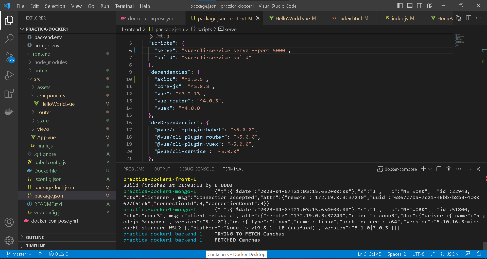
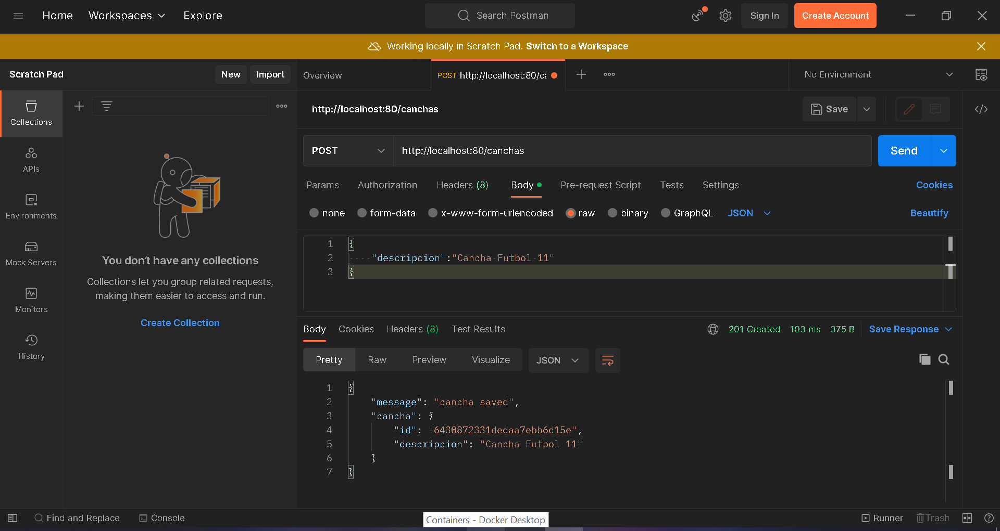

## Explicacion
Primero se trabaja creando e iniciando el backend para comprobar que la base de datos usada
en este caso MongoDB se inicie correctamente y tenga acceso al modelo usado, en este caso que
es sobre canchas, en donde solo aparecera el ID y una descripcion. Esto se mostrara con una pagina
sencilla a travez del frontend usando Vue.js y probamos agregando datos a travez de postman con
el localhost.

Despues de tener configurado lo anterior trabajaremos con el Docker donde tendremos que iniciarlo
con el mongodb, backend y frontend para que todo funcione correctamente.

## Screenshots

